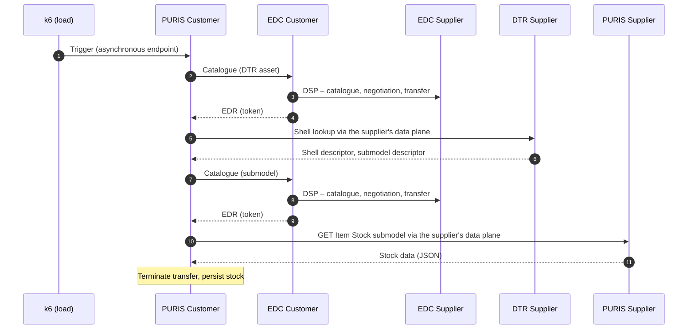
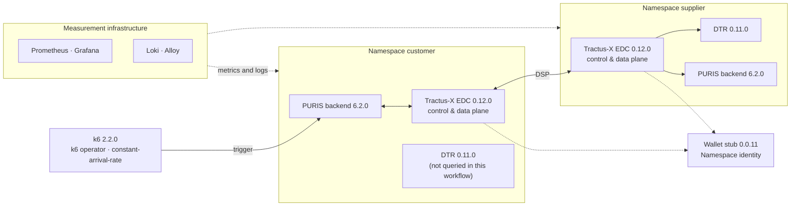

<div align="center">

# PURIS Performance Experiments

**Reproducible load and saturation experiments with PURIS (Eclipse Tractus-X)<br>on a Kubernetes-based data-space testbed**

Artefact of a bachelor's thesis · TU Dortmund University · Department of Computer Science

[](LICENSE)


[Overview](#overview) ·
[Setup](#experimental-setup) ·
[Methodology](#methodology) ·
[Results](#results) ·
[Reproduction](#reproduction) ·
[Repository](#repository-layout) ·
[Limitations](#scope-and-limitations) ·
[Citation](#citation)

</div>

---

> [!NOTE]
> **About this project.** This repository was created as part of a **bachelor's thesis at TU Dortmund University** (Department of Computer Science). The thesis itself is written in **German**, and so is most of the detailed documentation in this repository ([`KONZEPT.md`](KONZEPT.md), [`AUFBAU.md`](AUFBAU.md), [`LABORBUCH.md`](LABORBUCH.md), [`ANLEITUNG.md`](ANLEITUNG.md), [`VPS-VARIANTE.md`](VPS-VARIANTE.md), [`CHECKLISTE.md`](CHECKLISTE.md)), as well as the labels of the generated figures and tables. This README, [`REPRODUCE.md`](REPRODUCE.md) and the output of the `reproduce` script are in English.

## Overview

This repository contains the complete experiment of a bachelor's thesis on the **scaling and saturation behaviour of the PURIS application** from the open-source project [Eclipse Tractus-X](https://eclipse-tractusx.github.io/). PURIS (*Predictive Unit Real-Time Information Service*) supports the short-term exchange of stock, demand, production and delivery information between business partners in the Catena-X data space.

The experiment studies the **Item Stock Exchange** (Catena-X standard CX-0122): a customer retrieves the stock of a supplier. A single transaction already passes through the entire call chain between two data-space participants – both connectors (EDC), the supplier's Digital Twin Registry (DTR) and both PURIS backends with their databases. This transaction is executed under a controlled, stepwise increasing load until the system saturates.

The repository is built so that every step can be traced and repeated:

- **Setup as code:** every component is a Helm release with a pinned version and fixed CPU and memory limits
- **Raw data:** every measurement run is stored completely and unchanged in [`runs/`](runs/), with checksums
- **Analysis:** a single command generates all figures, tables and key figures from the raw data
- **Documentation:** a binding concept, a step-by-step build log and a chronological laboratory notebook
- **Rebuild:** a single script ([`reproduce`](reproduce)) rebuilds the environment on an empty machine and measures

### Related thesis

| | |
|---|---|
| **Title** (German) | Empirische Charakterisierung des Skalierungs- und Sättigungsverhaltens der PURIS-Anwendung – Eine Fallstudie im Kontext industrieller Datenräume |
| **Title** (English translation) | Empirical Characterisation of the Scaling and Saturation Behaviour of the PURIS Application – A Case Study in the Context of Industrial Data Spaces |
| **Type** | Bachelor's thesis, Computer Science (B.Sc.) |
| **University** | TU Dortmund University, Department of Computer Science |
| **Language** | German |
| **Year** | 2026 |

**Research questions** (translated from the thesis)

| | |
|---|---|
| **RQ1** | How do throughput, response times, latency percentiles and error rates of the Item Stock Exchange workflow change under increasing load? |
| **RQ2** | From which load range do saturation effects occur, and which metrics make them visible? |
| **RQ3** | Which components show conspicuous patterns in resource usage or runtime behaviour at the point of saturation and are therefore bottleneck candidates? |

---

## Experimental setup

### Workflow under test

A transaction is triggered at the customer's backend with `GET /catena/stockView/update-reported-material-stocks`. The endpoint is **asynchronous**: it responds immediately, and the data exchange then runs in the background.



PURIS stores negotiated contracts and reuses them. If a retrieval fails, the contract data is discarded ("Invalidating … contract data") and the next retrieval negotiates again. A defined initial state is therefore restored before every run (see [Methodology](#methodology)).

### Components

The setup follows the PURIS deployment model (one EDC and one DTR **per participant**) and the Tractus-X "Hausanschluss" bundles. All components run on a single-node cluster (k3s) and address each other via Kubernetes service names.



| Block | Component | Helm chart | Application |
|---|---|---|---|
| `a1`–`a3` | Ubuntu Server, k3s, Helm | – | Ubuntu 26.04.1 LTS · k3s v1.37.1+k3s1 · Helm v4.3.0 |
| `b1` | Prometheus, Grafana, exporters | `kube-prometheus-stack` 91.9.0 | Prometheus v3.15.0 · Grafana 13.2.3 |
| `b2`, `b3` | Log storage and collection | `loki` 7.3.0 · `alloy` 1.13.0 | Loki 3.6.11 · Alloy v1.20.0 |
| `c1` | Identity, tokens, credentials, BPN directory (central) | `identity-and-trust-bundle` 1.1.3 | SSI DIM wallet stub 0.0.11 |
| `c2`, `c4` | EDC per participant (+ PostgreSQL, Vault) | `dataspace-connector-bundle` 1.3.0 | Tractus-X EDC 0.12.0 |
| `c3`, `c5` | DTR per participant (+ PostgreSQL) | `digital-twin-bundle` 1.3.0 | Digital Twin Registry 0.11.0 |
| `d1`, `d2` | PURIS backend per participant (+ PostgreSQL) | `puris` 7.2.0 (Git tag `puris-7.2.0`) | PURIS 6.2.0 |
| `e1`, `e2` | Test data (20 materials) and functional test | – (PURIS REST API) | – |
| `f1` | Load generator | `k6-operator` 4.6.0 | k6 operator 1.6.0 · k6 2.2.0 |

EDC 0.12.0 and DTR 0.11.0 are the versions PURIS has been aligned with since 6.0.0. Keycloak, portal, BPDM, discovery services, a separate BDRS server and an ingress controller are **deliberately not** part of the setup: they are not needed for the data exchange, and an additional proxy would sit in every request between the participants. PURIS is operated exclusively via its REST API with an API key. Rationale and sources: [`KONZEPT.md`](KONZEPT.md), section 3. All versions including image digests: [`AUFBAU.md`](AUFBAU.md), version overview.

### Environments and resource profiles

Every container has fixed limits (`requests = limits`, QoS `Guaranteed`); there is no autoscaling. The limits are a property of the experimental setup: with smaller limits, saturation occurs at lower load, while its course and the bottleneck remain measurable.

| Environment | Machine | Profile | Role |
|---|---|---|---|
| **Main environment (NAS VM)** | 8 vCPU (threads shared with the host), 32 GB RAM | `compact` (NAS profile): 7000m CPU allocatable, system under test 4.55 cores | Setup, pilot studies, main measurements K0 and K1; rebuild test with `reproduce` on the freshly installed VM |
| **Second environment** | 24 vCPU, 48 GB RAM | `original`: resources as shipped by the charts | Original configuration (`original-k0`, `original-k1`) with `reproduce` |

Resources per container with rationale: [`VPS-VARIANTE.md`](VPS-VARIANTE.md) (NAS profile) and [`AUFBAU.md`](AUFBAU.md), resource overview.

### Configurations

| Configuration | Change compared to K0 | Overlay |
|---|---|---|
| **K0** – baseline | – | `setup/*/values.yaml` |
| **K1** – EDC relieved | Control plane of the customer EDC 500m → 1000m, PostgreSQL of both EDCs 200m → 400m; the CPU is taken from barely used allocations (data planes, supplier Vault, both PURIS backends), so the total stays within 7000m | `setup/*/k1-nas.yaml` |
| `original-k0`, `original-k1` | Chart defaults; in `original-k1` the EDC PostgreSQL uses preset `small` instead of `nano` | `setup/*/original-k1.yaml` (`reproduce` only) |

K1 tests the bottleneck hypothesis from the pilot studies (RQ3): if a targeted relief of the EDC shifts the tipping point, its resources determine the performance limit. Every change to the setup is frozen with a Git tag: `setup-v1` (before K0), `setup-v2` (collector fixed, system under test unchanged), `setup-v3` (overlays and measurement plan for K1).

---

## Methodology

| Aspect | Implementation |
|---|---|
| **Load model** | Open model, k6 `constant-arrival-rate`; load = triggered transactions per second, not number of users |
| **Plan K0** ([`k0.env`](experiments/plans/k0.env)) | Warm-up 0.1 and 0.3/s · load stages 0.2 – 0.3 – 0.4 – 0.5 – 0.6 – 0.7 – 0.8 – 1.0/s · recovery stage 0.2/s · 10 min each · 20 materials |
| **Plan K1** ([`k1.env`](experiments/plans/k1.env)) | As K0, plus 1.5 – 2.0 – 2.5 – 3.0/s |
| **Initial state** | Before every run, PURIS and EDC of both participants are stopped, all seven databases are restored to a saved state and verified row by row, followed by an ordered restart and a functional test (`./lab reset`) |
| **Data sources** | k6 only provides the sent rate and `dropped_iterations` (proof that the planned load was sent). Completion, duration and errors of each transaction come from the PURIS logs (Loki) and the EDC transfer data; CPU, memory, CPU throttling and steal time from Prometheus |
| **Saturation criterion** | A stage is saturated if the completed transactions per second fall below 95 % of the input load. The **tipping point** of a run is the first saturated stage after warm-up. Errors (> 1 % failed) and contract invalidations are reported per stage as early indicators |
| **Validity per run** | Steal time (highest 1-min mean < 5 %, overall mean < 2 %), complete logs, no restarts during warm-up, pre-check before start; invalid runs are kept and complemented by a replacement run |
| **Repetitions** | At least three valid runs per configuration (`./lab series`) |
| **Reproducibility** | Terms following ACM: repeatable (repetitions), reproducible (rebuild with the published artefacts). Four pieces of evidence: repetitions with spread, rebuild test, open artefact, complete description ([`KONZEPT.md`](KONZEPT.md), section 8) |

---

## Results

> [!NOTE]
> **As of 9 October 2026 – main environment (NAS VM).** Measurements with the original configuration and the rebuild test are still pending. All values are generated by [`analysis/evaluation.py`](analysis/evaluation.py) from `runs/` and `nachtrag/`; the interpretation is part of the thesis.

| Configuration | Valid runs | Stable up to | Tipping point per run | Median | Duration at 0.5/s (p50 / p95) | Recovery at 0.2/s |
|---|:-:|:-:|:-:|:-:|:-:|:-:|
| **K0-NAS** | 6 | 0.5–0.6/s | 0.7 · 0.6 · 0.7 · 0.7 · 0.6 · 0.7/s | 0.70/s | 3.4 s / 5.1 s | none |
| **K1-NAS** | 4 | 1.0–1.5/s | 1.5 · 2.0 · 1.5 · 1.5/s | 1.50/s | 3.1 s / 4.3 s | none |

**Observations**

- **Tipping point shifted:** K1 shifts the tipping point by a factor of about 2.1 in the median (2.4 in the mean). The distributions do not overlap (exact two-sided Mann-Whitney U test: U = 0, p = 0.005).
- **No recovery:** After tipping, the system completes no transactions even in the recovery stage (0.2/s) – in all valid runs of both configurations.
- **Trigger and amplification:** In the pilot studies, tipping started with a lock conflict between the EDCs (HTTP 409 "currently leased"). Timeouts lead to discarded contract data and to renegotiation per transaction; the tipped system stayed busy for hours after the load had ended.
- **Bottleneck candidate (hypothesis):** In K0, the control plane and the PostgreSQL of the EDCs were at their CPU limit and constantly throttled in the tipped state. The shifted tipping point in K1 supports this hypothesis.

<details>
<summary><b>All main measurement runs</b> (including invalid and aborted runs)</summary>

| Run | Configuration | Setup | Status | Tipping point | Max. steal |
|---|---|---|---|:-:|:-:|
| `2026-10-07_2341_k0_rep-1` | K0-NAS | `setup-v1` | invalid (steal time) | – | 6.0 % |
| `2026-10-08_0140_k0_rep-2` | K0-NAS | `setup-v1` | valid | 0.7/s | 1.9 % |
| `2026-10-08_0340_k0_rep-3` | K0-NAS | `setup-v1` | valid | 0.6/s | 2.2 % |
| `2026-10-08_0540_k0_rep-4` | K0-NAS | `setup-v1` | valid | 0.7/s | 1.9 % |
| `2026-10-08_1252_k0_rep-5` | K0-NAS | `setup-v2` | valid | 0.7/s | 2.4 % |
| `2026-10-08_1453_k0_rep-6` | K0-NAS | `setup-v2` | valid | 0.6/s | 1.9 % |
| `2026-10-08_1654_k0_rep-7` | K0-NAS | `setup-v2` | valid | 0.7/s | 2.1 % |
| `2026-10-08_1943_k1_rep-1` | K1-NAS | `setup-v3` | attempt (aborted) | – | – |
| `2026-10-08_2220_k1_rep-2` | K1-NAS | `setup-v3` | invalid (steal time) | – | 9.1 % |
| `2026-10-09_0106_k1_rep-3` | K1-NAS | `setup-v3` | valid | 1.5/s | 3.5 % |
| `2026-10-09_0352_k1_rep-4` | K1-NAS | `setup-v3` | valid | 2.0/s | 4.1 % |
| `2026-10-09_0646_k1_rep-5` | K1-NAS | `setup-v3` | attempt (rejected by pre-check) | – | – |
| `2026-10-09_0701_k1_rep-6` | K1-NAS | `setup-v3` | valid | 1.5/s | 3.8 % |
| `2026-10-09_0953_k1_rep-7` | K1-NAS | `setup-v3` | valid | 1.5/s | 3.8 % |

Source: [`analysis/out/tables/runs.csv`](analysis/out/tables/runs.csv). The pilot run, smoke tests and pilot studies 1–3 (7 October 2026) are also stored in [`runs/`](runs/); their findings are described in [`LABORBUCH.md`](LABORBUCH.md) (German).

</details>

**Figures** (vector graphics, PDF, German labels):
[Throughput](analysis/out/figures/durchsatz_NAS.pdf) ·
[Duration](analysis/out/figures/dauer_NAS.pdf) ·
[Errors](analysis/out/figures/fehler_NAS.pdf) ·
[CPU per component](analysis/out/figures/cpu_NAS.pdf) ·
[Tipping points per run](analysis/out/figures/kipppunkte_NAS.pdf) ·
[Time series K0](analysis/out/figures/zeitreihe_K0-NAS.pdf) ·
[Time series K1](analysis/out/figures/zeitreihe_K1-NAS.pdf)

---

## Reproduction

### 1. Regenerate the analysis from the raw data

No cluster needed, takes a few seconds. Regenerates `analysis/out/` completely (figures, tables, `zahlen.tex` with LaTeX macros, `manifest.json` with inputs and code version). With unchanged raw data, figures, tables and key figures are byte-identical; only the commit entry in `manifest.json` changes.

```bash
git clone https://github.com/artamrj/puris-performance-experiments.git
cd puris-performance-experiments
python3 -m venv analysis/.venv
analysis/.venv/bin/pip install -r analysis/requirements.txt
analysis/.venv/bin/python analysis/evaluation.py
```

Dependencies are pinned in [`analysis/requirements.txt`](analysis/requirements.txt) (Python 3.14). The raw data amounts to about 0.5 GB.

### 2. Full rebuild with `reproduce`

[`reproduce`](reproduce) is a single script that installs k3s and all components in their pinned versions on an empty machine, creates the test data, measures, compares the result with a reference and stores the runs in the format of `runs/`. Before starting, a calculator checks whether the machine is large enough for the `original` or the `compact` profile.

Run it **on the server** (Ubuntu Server, amd64, with `sudo` and internet access), for example after `ssh <server>` – not on a laptop:

```bash
curl -fsSLO https://raw.githubusercontent.com/artamrj/puris-performance-experiments/main/reproduce
chmod +x reproduce
./reproduce
```

| Requirement | Value |
|---|---|
| Operating system | Ubuntu Server (tested: 26.04.1 LTS), amd64, `sudo`, internet access |
| Profile `compact` | at least 8 vCPU and 28 GB RAM (32 GB recommended) |
| Profile `original` | at least 20 vCPU (24 vCPU and 32 GB RAM recommended) |
| Duration | about 2–2.5 h per measurement run, three valid runs per configuration |

Every phase can be called on its own (`fetch`, `tools`, `check`, `install`, `deploy`, `prepare`, `verify`, `measure`, `evaluate`, `package`); `./reproduce status` shows the progress, `./reproduce uninstall` removes the script's own cluster again. Success criterion of the rebuild (fixed in advance): the median tipping point lies at most one load stage outside the range of the reference (for `compact-k0`: 0.5–0.8/s). Specification: [`REPRODUCE.md`](REPRODUCE.md).

> [!IMPORTANT]
> `reproduce` is implemented and checked without a cluster (ShellCheck, rendered charts, analysis against the NAS runs), but has **not yet run on a cluster**. Planned are the `original` profile on the second environment and the rebuild test with `compact` on the freshly installed NAS VM (comparison with K0 and K1).

### 3. Measurement runs on an existing setup with `lab`

The main measurements on the NAS VM were performed with [`lab`](lab). A run only starts on the VM and only with a clean Git state, so that the commit hash in `meta.json` is valid. Messages of `lab` are in German.

| Command | Effect |
|---|---|
| `./lab snapshot <name>` | Save the state of all seven databases |
| `./lab reset <name>` | Restore and verify the initial state |
| `./lab check` | Functional test: three real transactions in a row |
| `./lab run <plan> <rep>` | One measurement run: pre-check → reset → functional test → load → drain → collection into `runs/` |
| `./lab series <plan> <n>` | Measurement series with a replacement run for every failed run |
| `./lab status` | Last message, lock, readiness of PURIS and EDC, active load |

### 4. Manual setup

[`AUFBAU.md`](AUFBAU.md) (German) contains every command that was actually executed, in the order of execution, with a check and the observed result – from the empty VM to the functional test.

### Tests

The calculation rules of the analysis, the collector and the safeguards of `lab` are covered by unit tests (no cluster needed):

```bash
analysis/.venv/bin/python -m unittest discover -s tests
```

---

## Repository layout

```text
.
├── KONZEPT.md          Binding concept: building blocks, rules, measurement, reproducibility, decisions
├── AUFBAU.md           Step-by-step build log with version and resource overview
├── LABORBUCH.md        Chronological laboratory notebook: problems, findings, decisions
├── ANLEITUNG.md        Overview in plain language
├── VPS-VARIANTE.md     NAS profile, steal time, options for the rebuild test
├── REPRODUCE.md        Specification of `reproduce` (English)
├── CHECKLISTE.md       Progress per stage and building block
├── lab                 Control of measurement runs (reset, run, series, status)
├── reproduce           Self-contained script for rebuild and measurement
├── lib/                Helpers of `lab` (databases, lifecycle, Loki, snapshots)
├── setup/              Helm values per building block (a2 … d2), overlays for K1, test data (e1)
├── experiments/
│   ├── plans/          Measurement plans (load stages, duration, validity limits)
│   ├── k6/             k6 script and TestRun generation
│   └── collect/        Collection of measurement data after each run
├── runs/               Raw data: one folder per measurement run, never modified
├── nachtrag/           Complete Loki logs for runs up to 8 October 2026 (run folders unchanged)
├── reference/          Reference result for the comparison in the rebuild test
├── analysis/           Analysis: runs/ → out/ (figures, tables, key figures)
└── tests/              Unit tests for analysis, collector and lab
```

All Markdown documents except this README and `REPRODUCE.md` are written in German.

**Contents of a run folder** (`runs/<date>_<time>_<plan>_rep-<n>/`):

| File / folder | Contents |
|---|---|
| `meta.json` | Git commit, tag, versions, measurement plan, configuration, timestamps of every stage (UTC), node information, validity |
| `attempt.json`, `events.jsonl`, `reset.json` | Course of the attempt, events, result of the reset |
| `k6-summary.json`, `k6-stages.json`, `testrun.json` | Sent load, stage boundaries, k6 TestRun used |
| `loki/` | PURIS logs of both participants, warnings and errors of the EDCs |
| `edc/` | Contract negotiations and transfer times of both EDCs |
| `prometheus/` | CPU, memory, throttling, threads, restarts, steal time, k6 metrics (CSV) |
| `db/` | Row counts of all seven databases after the run |
| `cluster/` | Pods, Helm releases, images with digests, log of the k6 runner |
| `SHA256SUMS` | Checksums of all files of the run |

---

## Scope and limitations

The results apply to the documented configuration and the defined load profiles; they do not constitute a general performance statement about PURIS or Tractus-X installations. Known limitations:

- **One workflow, one direction:** only the Item Stock Exchange, with the customer retrieving from the supplier; one partner, 20 materials. Transferability to other PURIS workflows is an untested hypothesis.
- **Single node:** all components, the measurement infrastructure and the load generator share one node; their consumption and throttling are recorded per run.
- **Shared hardware:** the NAS VM shares its threads with the host (performance and efficiency cores). The influence is measured via steal time and bounded as a validity criterion.
- **Simplified data space:** wallet stub instead of a full identity infrastructure, Vault in dev mode, DTR without authentication, bundles intended for test and pilot environments; deviations from the PURIS reference are documented in [`KONZEPT.md`](KONZEPT.md).
- **Asynchronous measurement:** duration and success of a transaction are reconstructed from logs, not taken from the HTTP response time.
- **Bottleneck analysis:** bottlenecks are derived as candidates from temporal correlation and targeted relief (K1); K1 changes the control plane and the databases of the EDC at the same time.

---

## Methodological foundations and sources

- S. Henning, B. Wetzel, W. Hasselbring (2021): reproducible benchmarking of cloud-native applications on Kubernetes
- S. Kounev et al. (2025): *Systems Benchmarking*
- ACM: *Artifact Review and Badging* (terms repeatable, reproducible, replicable)
- [PURIS 6.2.0](https://github.com/eclipse-tractusx/puris/releases/tag/6.2.0) · [Helm chart `puris` 7.2.0](https://github.com/eclipse-tractusx/puris/tree/6.2.0/charts/puris) · [Runtime view of the architecture documentation](https://github.com/eclipse-tractusx/puris/blob/6.2.0/docs/architecture/06_runtime_view.md)
- [Tractus-X umbrella](https://github.com/eclipse-tractusx/tractus-x-umbrella) · [k6: open and closed load models](https://grafana.com/docs/k6/latest/using-k6/scenarios/concepts/open-vs-closed/)

---

## Citation

If you use this work, please cite the related bachelor's thesis and this repository with a tag or commit hash – every run folder and every analysis output records the commit it was produced with.

```bibtex
@software{puris_performance_experiments,
  title   = {PURIS Performance Experiments: Reproducible Load and Saturation Experiments
             with PURIS (Eclipse Tractus-X)},
  url     = {https://github.com/artamrj/puris-performance-experiments},
  version = {setup-v3},
  year    = {2026},
  note    = {Artefact of the bachelor's thesis "Empirische Charakterisierung des Skalierungs-
             und Sättigungsverhaltens der PURIS-Anwendung" (in German), TU Dortmund University}
}
```

## License

[Apache License 2.0](LICENSE). The components used (PURIS, Tractus-X EDC, Digital Twin Registry, wallet stub, Grafana stack, k6) are subject to their own licenses. The test data is fictitious data from the PURIS integration tests. Credentials in this repository are test values only (publicly known chart defaults or fixed test passwords of `reproduce`, marked as such); EDC keys are generated locally per machine and are not published. Not intended for production use.
