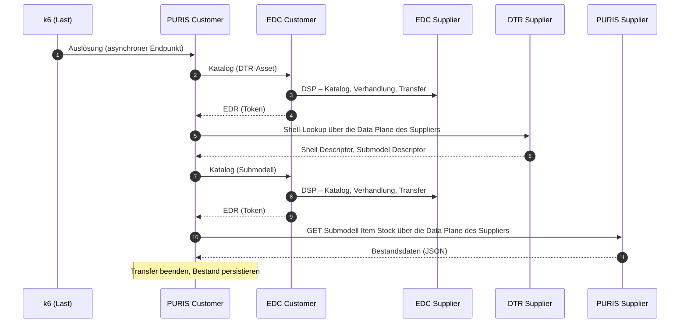
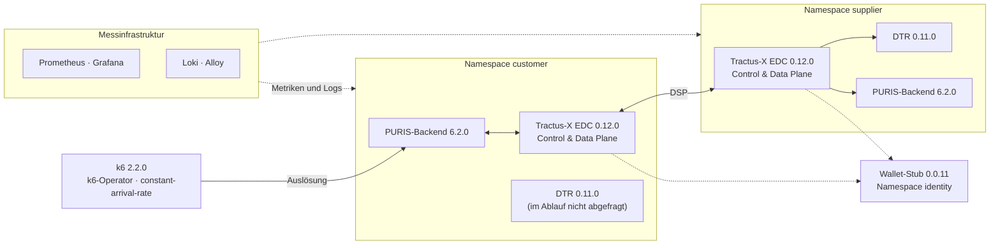

<div align="center">

# PURIS Performance Experiments

**Reproduzierbare Last- und Sättigungsexperimente mit PURIS (Eclipse Tractus-X)<br>in einem Kubernetes-basierten Datenraum-Testbed**

Artefakt einer Bachelorarbeit · Technische Universität Dortmund · Fakultät für Informatik

[](LICENSE)


[Überblick](#überblick) ·
[Versuchsaufbau](#versuchsaufbau) ·
[Messmethodik](#messmethodik) ·
[Ergebnisse](#ergebnisse) ·
[Reproduktion](#reproduktion) ·
[Repository](#aufbau-des-repositorys) ·
[Einschränkungen](#gültigkeitsbereich-und-einschränkungen) ·
[Zitation](#zitation)

</div>

---

## Überblick

Dieses Repository enthält das vollständige Experiment einer Bachelorarbeit zum **Skalierungs- und Sättigungsverhalten der PURIS-Anwendung** aus dem Open-Source-Projekt [Eclipse Tractus-X](https://eclipse-tractusx.github.io/). PURIS (*Predictive Unit Real-Time Information Service*) unterstützt im Catena-X-Datenraum den kurzfristigen Austausch von Bestands-, Bedarfs-, Produktions- und Lieferinformationen zwischen Geschäftspartnern.

Untersucht wird der **Item-Stock-Exchange** (Catena-X-Standard CX-0122): Ein Customer ruft den Bestand eines Suppliers ab. Bereits eine einzelne Transaktion durchläuft die gesamte Aufrufkette zwischen zwei Datenraum-Teilnehmern – beide Konnektoren (EDC), die Digital Twin Registry (DTR) des Suppliers und beide PURIS-Backends mit ihren Datenbanken. Diese Transaktion wird unter kontrolliert steigender Last ausgeführt, bis das System sättigt.

Das Repository ist so aufgebaut, dass jeder Schritt nachvollziehbar und wiederholbar ist:

- **Aufbau als Code:** jede Komponente ein Helm-Release mit fester Version und festgelegten CPU- und Speichergrenzen
- **Rohdaten:** jeder Messlauf vollständig und unverändert in [`runs/`](runs/), mit Prüfsummen
- **Auswertung:** ein Befehl erzeugt alle Abbildungen, Tabellen und Kennzahlen aus den Rohdaten
- **Dokumentation:** verbindliches Konzept, Schritt-für-Schritt-Aufbau und chronologisches Laborbuch
- **Nachbau:** ein einzelnes Skript ([`reproduce`](reproduce)) baut die Umgebung auf einer leeren Maschine neu auf und misst

> **Summary (English).** This repository is the open artefact of a bachelor's thesis (TU Dortmund) on the scaling and saturation behaviour of PURIS, an Eclipse Tractus-X reference application for supply-chain data exchange in the Catena-X data space. The *Item Stock Exchange* between two data-space participants (each with its own EDC connector, Digital Twin Registry and PURIS backend) runs on a single-node k3s cluster under a stepwise increasing open-model load generated by k6. Completion, duration and errors of each transaction are derived from PURIS logs and EDC data, resource usage from Prometheus. The repository contains the complete setup as Helm values, the measurement tooling, all raw data, the analysis and a self-contained rebuild script. Documentation is written in German; [`REPRODUCE.md`](REPRODUCE.md) and the output of `reproduce` are in English.

### Zugehörige Arbeit

| | |
|---|---|
| **Titel** | Empirische Charakterisierung des Skalierungs- und Sättigungsverhaltens der PURIS-Anwendung – Eine Fallstudie im Kontext industrieller Datenräume |
| **Art** | Bachelorarbeit, Studiengang Informatik |
| **Hochschule** | Technische Universität Dortmund, Fakultät für Informatik |
| **Jahr** | 2026 |

**Forschungsfragen**

| | |
|---|---|
| **F1** | Wie verändern sich Durchsatz, Antwortzeiten, Latenzperzentile und Fehlerraten des Item-Stock-Exchange-Workflows bei steigender Last? |
| **F2** | Ab welchem Lastbereich treten Sättigungseffekte auf, und durch welche Messgrößen werden sie sichtbar? |
| **F3** | Welche Komponenten zeigen zum Zeitpunkt der Sättigung auffällige Muster im Ressourcenverbrauch oder Laufzeitverhalten und kommen dadurch als Engpässe in Betracht? |

---

## Versuchsaufbau

### Untersuchter Ablauf

Eine Transaktion wird am Backend des Customers mit `GET /catena/stockView/update-reported-material-stocks` ausgelöst. Der Endpunkt ist **asynchron**: Er antwortet sofort, der Datenaustausch läuft danach im Hintergrund.



PURIS speichert ausgehandelte Verträge und verwendet sie wieder. Schlägt ein Abruf fehl, werden die Vertragsdaten verworfen („Invalidating … contract data“), und der nächste Abruf verhandelt neu. Deshalb wird vor jedem Lauf ein definierter Ausgangszustand hergestellt (siehe [Messmethodik](#messmethodik)).

### Komponenten

Der Aufbau folgt dem Bereitstellungsmodell von PURIS (EDC und DTR **je Teilnehmer**) und den „Hausanschluss“-Bundles von Tractus-X. Alle Komponenten laufen auf einem Single-Node-Cluster (k3s) und finden sich über Kubernetes-Dienstnamen.



| Baustein | Komponente | Helm-Chart | Anwendung |
|---|---|---|---|
| `a1`–`a3` | Ubuntu Server, k3s, Helm | – | Ubuntu 26.04.1 LTS · k3s v1.37.1+k3s1 · Helm v4.3.0 |
| `b1` | Prometheus, Grafana, Exporter | `kube-prometheus-stack` 91.9.0 | Prometheus v3.15.0 · Grafana 13.2.3 |
| `b2`, `b3` | Logs speichern und sammeln | `loki` 7.3.0 · `alloy` 1.13.0 | Loki 3.6.11 · Alloy v1.20.0 |
| `c1` | Identität, Tokens, Nachweise, BPN-Verzeichnis (zentral) | `identity-and-trust-bundle` 1.1.3 | SSI-DIM-Wallet-Stub 0.0.11 |
| `c2`, `c4` | EDC je Teilnehmer (+ PostgreSQL, Vault) | `dataspace-connector-bundle` 1.3.0 | Tractus-X EDC 0.12.0 |
| `c3`, `c5` | DTR je Teilnehmer (+ PostgreSQL) | `digital-twin-bundle` 1.3.0 | Digital Twin Registry 0.11.0 |
| `d1`, `d2` | PURIS-Backend je Teilnehmer (+ PostgreSQL) | `puris` 7.2.0 (Git-Tag `puris-7.2.0`) | PURIS 6.2.0 |
| `e1`, `e2` | Testdaten (20 Materialien) und Funktionstest | – (REST-API von PURIS) | – |
| `f1` | Lastgenerator | `k6-operator` 4.6.0 | k6-Operator 1.6.0 · k6 2.2.0 |

EDC 0.12.0 und DTR 0.11.0 sind die Versionen, auf die PURIS seit 6.0.0 abgestimmt ist. Bewusst **nicht** Teil des Aufbaus sind Keycloak, Portal, BPDM, Discovery-Dienste, ein eigener BDRS-Server und ein Ingress-Controller: Sie werden für den Datenaustausch nicht benötigt, und ein zusätzlicher Proxy läge in jeder Anfrage zwischen den Teilnehmern. PURIS wird ausschließlich über die REST-API mit API-Key bedient. Herleitung und Quellen: [`KONZEPT.md`](KONZEPT.md), Abschnitt 3. Alle Versionen einschließlich Image-Digests: [`AUFBAU.md`](AUFBAU.md), Versionsübersicht.

### Umgebungen und Ressourcenprofile

Jeder Container hat feste Grenzen (`requests = limits`, QoS `Guaranteed`); kein automatisches Skalieren. Die Grenzen sind eine Eigenschaft des Versuchsaufbaus: Mit kleineren Grenzen tritt die Sättigung bei geringerer Last ein, Verlauf und Engpass bleiben messbar.

| Umgebung | Maschine | Profil | Rolle |
|---|---|---|---|
| **Hauptumgebung (NAS-VM)** | 8 vCPU (mit dem Host geteilte Threads), 32 GB RAM | `compact` (NAS-Profil): 7000m CPU zuteilbar, System unter Test 4,55 Kerne | Aufbau, Vorstudien, Hauptmessungen K0 und K1; Nachbau-Test mit `reproduce` auf der neu aufgesetzten VM |
| **Zweite Umgebung** | 24 vCPU, 48 GB RAM | `original`: Ressourcen wie von den Charts ausgeliefert | Original-Konfiguration (`original-k0`, `original-k1`) mit `reproduce` |

Ressourcen je Container mit Begründung: [`VPS-VARIANTE.md`](VPS-VARIANTE.md) (NAS-Profil) und [`AUFBAU.md`](AUFBAU.md), Ressourcenübersicht.

### Konfigurationen

| Konfiguration | Änderung gegenüber K0 | Überlagerung |
|---|---|---|
| **K0** – Grundkonfiguration | – | `setup/*/values.yaml` |
| **K1** – EDC entlastet | Control Plane des Customer-EDC 500m → 1000m, PostgreSQL beider EDCs 200m → 400m; die CPU stammt aus kaum genutzten Zuteilungen (Data Planes, Vault des Suppliers, beide PURIS-Backends), die Summe bleibt in 7000m | `setup/*/k1-nas.yaml` |
| `original-k0`, `original-k1` | Chart-Standardwerte; in `original-k1` PostgreSQL der EDCs mit Preset `small` statt `nano` | `setup/*/original-k1.yaml` (nur `reproduce`) |

K1 prüft die Engpasshypothese aus den Vorstudien (F3): Verschiebt eine gezielte Entlastung der EDC den Kipppunkt, bestimmen deren Ressourcen die Leistungsgrenze. Jede Änderung am Aufbau ist mit einem Git-Tag eingefroren: `setup-v1` (vor K0), `setup-v2` (Sammler korrigiert, System unter Test unverändert), `setup-v3` (Überlagerungen und Messplan für K1).

---

## Messmethodik

| Aspekt | Umsetzung |
|---|---|
| **Lastmodell** | Offenes Modell, k6 `constant-arrival-rate`; Last = ausgelöste Transaktionen pro Sekunde, nicht Anzahl von Nutzern |
| **Messplan K0** ([`k0.env`](experiments/plans/k0.env)) | Aufwärmen 0,1 und 0,3/s · Laststufen 0,2 – 0,3 – 0,4 – 0,5 – 0,6 – 0,7 – 0,8 – 1,0/s · Erholungsstufe 0,2/s · je 10 min · 20 Materialien |
| **Messplan K1** ([`k1.env`](experiments/plans/k1.env)) | wie K0, zusätzlich 1,5 – 2,0 – 2,5 – 3,0/s |
| **Ausgangszustand** | Vor jedem Lauf werden PURIS und EDC beider Teilnehmer angehalten, alle sieben Datenbanken auf einen gesicherten Stand zurückgesetzt und zeilenweise geprüft; danach geordneter Neustart und Funktionstest (`./lab reset`) |
| **Datenquellen** | k6 liefert nur die gesendete Rate und `dropped_iterations` (Nachweis der geplanten Last). Abschluss, Dauer und Fehler jeder Transaktion stammen aus den PURIS-Logs (Loki) und den Transferdaten der EDCs; CPU, Arbeitsspeicher, CPU-Drosselung und Steal Time aus Prometheus |
| **Sättigungskriterium** | Eine Stufe ist gesättigt, wenn die abgeschlossenen Transaktionen pro Sekunde unter 95 % der Eingangslast liegen. Der **Kipppunkt** eines Laufs ist die erste gesättigte Stufe nach dem Aufwärmen. Fehler (> 1 % gescheitert) und Vertragsinvalidierungen werden als Vorboten je Stufe berichtet |
| **Gültigkeit je Lauf** | Steal Time (höchstes 1-min-Mittel < 5 %, Mittel < 2 %), Vollständigkeit der Logs, keine Neustarts während des Aufwärmens, Vorprüfung vor dem Start; ungültige Läufe bleiben erhalten und werden durch einen Ersatzlauf ergänzt |
| **Wiederholungen** | mindestens drei gültige Läufe je Konfiguration (`./lab series`) |
| **Reproduzierbarkeit** | Begriffe nach ACM: wiederholbar (Wiederholungen), reproduzierbar (Nachbau mit den veröffentlichten Artefakten). Vier Nachweise: Wiederholungen mit Streuung, Nachbau-Test, offenes Artefakt, vollständige Beschreibung ([`KONZEPT.md`](KONZEPT.md), Abschnitt 8) |

---

## Ergebnisse

> [!NOTE]
> **Stand 09.10.2026 – Hauptumgebung (NAS-VM).** Messungen in der Original-Konfiguration und der Nachbau-Test stehen noch aus. Alle Werte erzeugt [`analysis/evaluation.py`](analysis/evaluation.py) aus `runs/` und `nachtrag/`; die Interpretation erfolgt in der Arbeit.

| Konfiguration | Gültige Läufe | Stabil bis | Kipppunkt je Lauf | Median | Dauer bei 0,5/s (p50 / p95) | Erholung bei 0,2/s |
|---|:-:|:-:|:-:|:-:|:-:|:-:|
| **K0-NAS** | 6 | 0,5–0,6/s | 0,7 · 0,6 · 0,7 · 0,7 · 0,6 · 0,7/s | 0,70/s | 3,4 s / 5,1 s | keine |
| **K1-NAS** | 4 | 1,0–1,5/s | 1,5 · 2,0 · 1,5 · 1,5/s | 1,50/s | 3,1 s / 4,3 s | keine |

**Beobachtungen**

- **Kipppunkt verschoben:** K1 verschiebt den Kipppunkt im Median etwa um den Faktor 2,1 (Mittelwert 2,4). Die Verteilungen überlappen nicht (exakter zweiseitiger Mann-Whitney-U-Test: U = 0, p = 0,005).
- **Keine Erholung:** Nach dem Kippen schließt das System auch in der Erholungsstufe (0,2/s) keine Transaktionen mehr ab – in allen gültigen Läufen beider Konfigurationen.
- **Auslöser und Verstärkung:** In den Vorstudien begann das Kippen mit einem Sperrkonflikt zwischen den EDCs (HTTP 409 „currently leased“). Zeitüberschreitungen führen zum Verwerfen von Vertragsdaten und zu Neuverhandlungen je Transaktion; das gekippte System blieb nach Lastende noch Stunden beschäftigt.
- **Engpasskandidat (Hypothese):** In K0 waren Control Plane und PostgreSQL der EDCs im gekippten Zustand am CPU-Limit und durchgehend gedrosselt. Die Verschiebung des Kipppunkts in K1 stützt diese Hypothese.

<details>
<summary><b>Alle Hauptmessläufe</b> (einschließlich ungültiger und abgebrochener Läufe)</summary>

| Lauf | Konfiguration | Aufbau | Status | Kipppunkt | Steal max. |
|---|---|---|---|:-:|:-:|
| `2026-10-07_2341_k0_rep-1` | K0-NAS | `setup-v1` | ungültig (Steal Time) | – | 6,0 % |
| `2026-10-08_0140_k0_rep-2` | K0-NAS | `setup-v1` | gültig | 0,7/s | 1,9 % |
| `2026-10-08_0340_k0_rep-3` | K0-NAS | `setup-v1` | gültig | 0,6/s | 2,2 % |
| `2026-10-08_0540_k0_rep-4` | K0-NAS | `setup-v1` | gültig | 0,7/s | 1,9 % |
| `2026-10-08_1252_k0_rep-5` | K0-NAS | `setup-v2` | gültig | 0,7/s | 2,4 % |
| `2026-10-08_1453_k0_rep-6` | K0-NAS | `setup-v2` | gültig | 0,6/s | 1,9 % |
| `2026-10-08_1654_k0_rep-7` | K0-NAS | `setup-v2` | gültig | 0,7/s | 2,1 % |
| `2026-10-08_1943_k1_rep-1` | K1-NAS | `setup-v3` | Versuch (abgebrochen) | – | – |
| `2026-10-08_2220_k1_rep-2` | K1-NAS | `setup-v3` | ungültig (Steal Time) | – | 9,1 % |
| `2026-10-09_0106_k1_rep-3` | K1-NAS | `setup-v3` | gültig | 1,5/s | 3,5 % |
| `2026-10-09_0352_k1_rep-4` | K1-NAS | `setup-v3` | gültig | 2,0/s | 4,1 % |
| `2026-10-09_0646_k1_rep-5` | K1-NAS | `setup-v3` | Versuch (Vorprüfung abgelehnt) | – | – |
| `2026-10-09_0701_k1_rep-6` | K1-NAS | `setup-v3` | gültig | 1,5/s | 3,8 % |
| `2026-10-09_0953_k1_rep-7` | K1-NAS | `setup-v3` | gültig | 1,5/s | 3,8 % |

Quelle: [`analysis/out/tables/runs.csv`](analysis/out/tables/runs.csv). Probelauf, Kurztests und die Vorstudien 1–3 (07.10.2026) liegen ebenfalls in [`runs/`](runs/); ihre Befunde sind im [`LABORBUCH.md`](LABORBUCH.md) beschrieben.

</details>

**Abbildungen** (Vektorgrafik, PDF):
[Durchsatz](analysis/out/figures/durchsatz_NAS.pdf) ·
[Dauer](analysis/out/figures/dauer_NAS.pdf) ·
[Fehler](analysis/out/figures/fehler_NAS.pdf) ·
[CPU je Komponente](analysis/out/figures/cpu_NAS.pdf) ·
[Kipppunkte je Lauf](analysis/out/figures/kipppunkte_NAS.pdf) ·
[Zeitreihe K0](analysis/out/figures/zeitreihe_K0-NAS.pdf) ·
[Zeitreihe K1](analysis/out/figures/zeitreihe_K1-NAS.pdf)

---

## Reproduktion

### 1. Auswertung aus den Rohdaten neu erzeugen

Ohne Cluster, in wenigen Sekunden. Erzeugt `analysis/out/` (Abbildungen, Tabellen, `zahlen.tex` mit LaTeX-Makros, `manifest.json` mit Eingaben und Code-Stand) vollständig neu; bei unveränderten Rohdaten sind Abbildungen, Tabellen und Kennzahlen byte-gleich, nur der Commit-Eintrag in `manifest.json` ändert sich.

```bash
git clone https://github.com/artamrj/puris-performance-experiments.git
cd puris-performance-experiments
python3 -m venv analysis/.venv
analysis/.venv/bin/pip install -r analysis/requirements.txt
analysis/.venv/bin/python analysis/evaluation.py
```

Die Abhängigkeiten sind in [`analysis/requirements.txt`](analysis/requirements.txt) mit festen Versionen angegeben (Python 3.14). Die Rohdaten umfassen etwa 0,5 GB.

### 2. Vollständiger Nachbau mit `reproduce`

[`reproduce`](reproduce) ist ein einzelnes Skript, das auf einer leeren Maschine k3s und alle Komponenten in den festen Versionen installiert, Testdaten anlegt, misst, das Ergebnis mit einer Referenz vergleicht und die Läufe im Format von `runs/` ablegt. Vor dem Start prüft ein Rechner, ob die Maschine für das Profil `original` oder `compact` ausreicht.

```bash
curl -fsSLO https://raw.githubusercontent.com/artamrj/puris-performance-experiments/main/reproduce
chmod +x reproduce
./reproduce
```

| Voraussetzung | Wert |
|---|---|
| Betriebssystem | Ubuntu Server (getestet: 26.04.1 LTS), amd64, `sudo`, Internetzugang |
| Profil `compact` | mindestens 8 vCPU und 28 GB RAM (empfohlen 32 GB) |
| Profil `original` | mindestens 20 vCPU (empfohlen 24 vCPU, 32 GB RAM) |
| Dauer | ca. 2–2,5 h je Messlauf, drei gültige Läufe je Konfiguration |

Jede Phase lässt sich einzeln aufrufen (`fetch`, `tools`, `check`, `install`, `deploy`, `prepare`, `verify`, `measure`, `evaluate`, `package`); `./reproduce status` zeigt den Stand, `./reproduce uninstall` entfernt den eigenen Cluster wieder. Erfolgskriterium des Nachbaus (vorher festgelegt): Der Median des Kipppunkts liegt höchstens eine Laststufe außerhalb der Spanne der Referenz (für `compact-k0`: 0,5–0,8/s). Spezifikation: [`REPRODUCE.md`](REPRODUCE.md).

> [!IMPORTANT]
> `reproduce` ist implementiert und ohne Cluster geprüft (Shellcheck, gerenderte Charts, Auswertung gegen die NAS-Läufe), aber **noch nicht auf einem Cluster gelaufen**. Geplant sind das Profil `original` auf der zweiten Umgebung und der Nachbau-Test mit `compact` auf der neu aufgesetzten NAS-VM (Vergleich mit K0 und K1).

### 3. Messläufe auf einem bestehenden Aufbau mit `lab`

Die Hauptmessungen auf der NAS-VM wurden mit [`lab`](lab) ausgeführt. Ein Lauf startet nur auf der VM und nur bei sauberem Git-Stand, damit der Commit-Hash in `meta.json` gültig ist.

| Befehl | Wirkung |
|---|---|
| `./lab snapshot <name>` | Stand aller sieben Datenbanken sichern |
| `./lab reset <name>` | Ausgangszustand herstellen und prüfen |
| `./lab check` | Funktionstest: drei echte Transaktionen nacheinander |
| `./lab run <plan> <rep>` | ein Messlauf: Vorprüfung → Reset → Funktionstest → Last → Abarbeiten → Sammeln nach `runs/` |
| `./lab series <plan> <n>` | Messreihe mit Ersatzlauf für jeden gescheiterten Lauf |
| `./lab status` | letzte Meldung, Sperre, Bereitschaft von PURIS und EDC, aktive Last |

### 4. Manueller Aufbau

[`AUFBAU.md`](AUFBAU.md) enthält jeden tatsächlich ausgeführten Befehl in der ausgeführten Reihenfolge, mit Prüfung und beobachtetem Ergebnis – von der leeren VM bis zum Funktionstest.

### Tests

Die Rechenregeln der Auswertung, der Sammler und die Schutzmechanismen von `lab` sind mit Unit-Tests abgedeckt (ohne Cluster):

```bash
analysis/.venv/bin/python -m unittest discover -s tests
```

---

## Aufbau des Repositorys

```text
.
├── KONZEPT.md          Verbindliches Konzept: Bausteine, Regeln, Messung, Reproduzierbarkeit, Entscheidungen
├── AUFBAU.md           Schritt-für-Schritt-Aufbau mit Versions- und Ressourcenübersicht
├── LABORBUCH.md        Chronologisches Laborbuch: Probleme, Befunde, Entscheidungen
├── ANLEITUNG.md        Überblick in einfacher Sprache
├── VPS-VARIANTE.md     NAS-Profil, Steal Time, Optionen für den Nachbau-Test
├── REPRODUCE.md        Spezifikation von `reproduce` (englisch)
├── CHECKLISTE.md       Fortschritt je Etappe und Baustein
├── lab                 Steuerung der Messläufe (Reset, Lauf, Messreihe, Status)
├── reproduce           Eigenständiges Skript für Neuaufbau und Messung
├── lib/                Hilfsfunktionen von `lab` (Datenbanken, Lebenszyklus, Loki, Snapshots)
├── setup/              Helm-Werte je Baustein (a2 … d2), Überlagerungen für K1, Testdaten (e1)
├── experiments/
│   ├── plans/          Messpläne (Laststufen, Dauer, Gültigkeitsgrenzen)
│   ├── k6/             k6-Skript und Erzeugung des TestRun
│   └── collect/        Sammeln der Messdaten nach jedem Lauf
├── runs/               Rohdaten: ein Ordner je Messlauf, nie verändert
├── nachtrag/           Vollständige Logs aus Loki für Läufe bis 08.10.2026 (Laufordner unverändert)
├── reference/          Referenzergebnis für den Vergleich im Nachbau-Test
├── analysis/           Auswertung: runs/ → out/ (Abbildungen, Tabellen, Kennzahlen)
└── tests/              Unit-Tests für Auswertung, Sammler und lab
```

**Inhalt eines Laufordners** (`runs/<Datum>_<Zeit>_<Plan>_rep-<n>/`):

| Datei / Ordner | Inhalt |
|---|---|
| `meta.json` | Git-Commit, Tag, Versionen, Messplan, Konfiguration, Zeitpunkte jeder Stufe (UTC), Knoten-Infos, Gültigkeit |
| `attempt.json`, `events.jsonl`, `reset.json` | Ablauf des Versuchs, Ereignisse, Ergebnis des Resets |
| `k6-summary.json`, `k6-stages.json`, `testrun.json` | gesendete Last, Stufengrenzen, verwendeter k6-TestRun |
| `loki/` | PURIS-Logs beider Teilnehmer, Warnungen und Fehler der EDCs |
| `edc/` | Vertragsverhandlungen und Transferzeiten beider EDCs |
| `prometheus/` | CPU, Arbeitsspeicher, Drosselung, Threads, Neustarts, Steal Time, k6-Metriken (CSV) |
| `db/` | Zeilenzahlen aller sieben Datenbanken nach dem Lauf |
| `cluster/` | Pods, Helm-Releases, Images mit Digests, Log des k6-Runners |
| `SHA256SUMS` | Prüfsummen aller Dateien des Laufs |

---

## Gültigkeitsbereich und Einschränkungen

Die Ergebnisse gelten für die dokumentierte Konfiguration und die definierten Lastprofile; eine allgemeine Leistungsaussage über PURIS- oder Tractus-X-Installationen ist damit nicht verbunden. Bekannte Einschränkungen:

- **Ein Workflow, eine Richtung:** nur der Item-Stock-Exchange, der Customer ruft beim Supplier ab; ein Partner, 20 Materialien. Die Übertragbarkeit auf andere PURIS-Workflows ist eine nicht geprüfte Hypothese.
- **Ein Knoten:** alle Komponenten, Messinfrastruktur und Lastgenerator teilen sich einen Knoten; deren Verbrauch und Drosselung werden je Lauf erfasst.
- **Geteilte Hardware:** Die NAS-VM teilt sich die Threads mit dem Host (Performance- und Effizienzkerne). Der Einfluss wird über die Steal Time gemessen und als Gültigkeitskriterium begrenzt.
- **Vereinfachter Datenraum:** Wallet-Stub statt vollständiger Identitätsinfrastruktur, Vault im Dev-Modus, DTR ohne Anmeldung, Bundles für Test- und Pilotumgebungen; Abweichungen von der PURIS-Referenz sind in [`KONZEPT.md`](KONZEPT.md) dokumentiert.
- **Asynchrone Messung:** Dauer und Erfolg einer Transaktion werden aus Logs rekonstruiert, nicht aus der HTTP-Antwortzeit.
- **Engpassanalyse:** Engpässe werden als Kandidaten aus zeitlicher Übereinstimmung und gezielter Entlastung (K1) abgeleitet; K1 verändert Control Plane und Datenbanken der EDC gleichzeitig.

---

## Methodische Grundlagen und Quellen

- S. Henning, B. Wetzel, W. Hasselbring (2021): reproduzierbares Benchmarking cloud-nativer Anwendungen auf Kubernetes
- S. Kounev et al. (2025): *Systems Benchmarking*
- ACM: *Artifact Review and Badging* (Begriffe wiederholbar, reproduzierbar, replizierbar)
- [PURIS 6.2.0](https://github.com/eclipse-tractusx/puris/releases/tag/6.2.0) · [Helm-Chart `puris` 7.2.0](https://github.com/eclipse-tractusx/puris/tree/6.2.0/charts/puris) · [Laufzeitsicht der Architekturdokumentation](https://github.com/eclipse-tractusx/puris/blob/6.2.0/docs/architecture/06_runtime_view.md)
- [Tractus-X Umbrella](https://github.com/eclipse-tractusx/tractus-x-umbrella) · [k6: offenes und geschlossenes Lastmodell](https://grafana.com/docs/k6/latest/using-k6/scenarios/concepts/open-vs-closed/)

---

## Zitation

Bei Verwendung bitte die zugehörige Bachelorarbeit sowie dieses Repository mit Tag oder Commit-Hash angeben – jeder Laufordner und jede Auswertung enthält den Commit, mit dem sie entstanden ist.

```bibtex
@software{puris_performance_experiments,
  title   = {PURIS Performance Experiments: Reproduzierbare Last- und Sättigungsexperimente
             mit PURIS (Eclipse Tractus-X)},
  url     = {https://github.com/artamrj/puris-performance-experiments},
  version = {setup-v3},
  year    = {2026},
  note    = {Artefakt der Bachelorarbeit „Empirische Charakterisierung des Skalierungs- und
             Sättigungsverhaltens der PURIS-Anwendung“, Technische Universität Dortmund}
}
```

## Lizenz

[Apache License 2.0](LICENSE). Die eingesetzten Komponenten (PURIS, Tractus-X EDC, Digital Twin Registry, Wallet-Stub, Grafana-Stack, k6) stehen unter ihren eigenen Lizenzen. Die Testdaten sind erfundene Daten aus den Integrationstests von PURIS. Zugangsdaten im Repository sind ausschließlich Testwerte (öffentlich bekannte Standardwerte der Charts bzw. feste, als solche gekennzeichnete Testpasswörter von `reproduce`); Schlüssel der EDCs werden je Maschine lokal erzeugt und nicht veröffentlicht. Nicht für den Produktivbetrieb geeignet.
