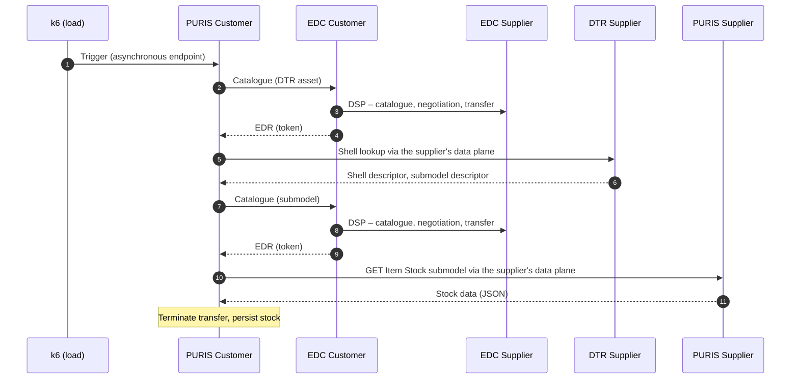
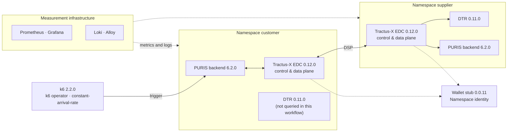
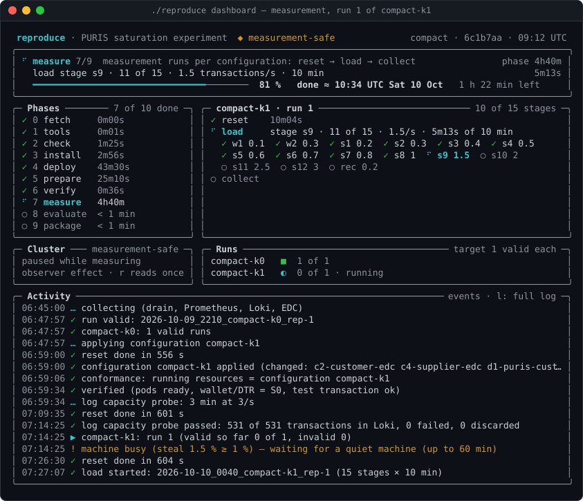
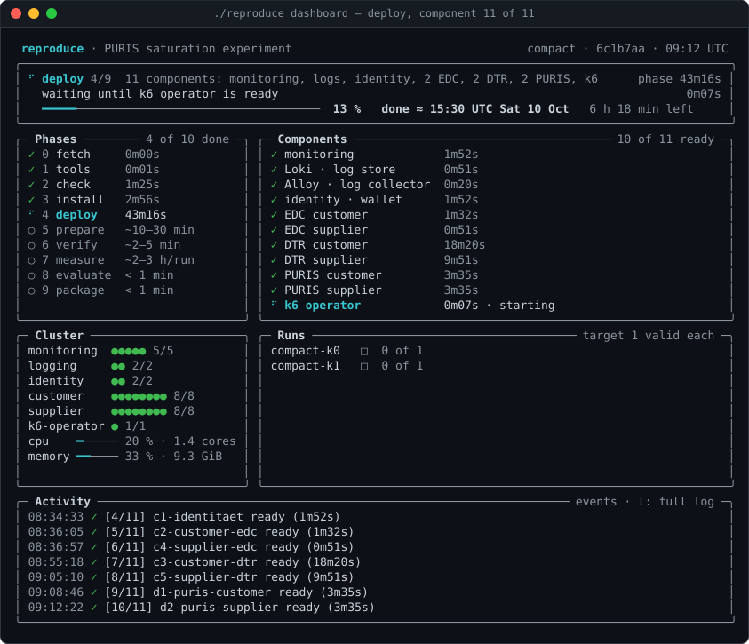
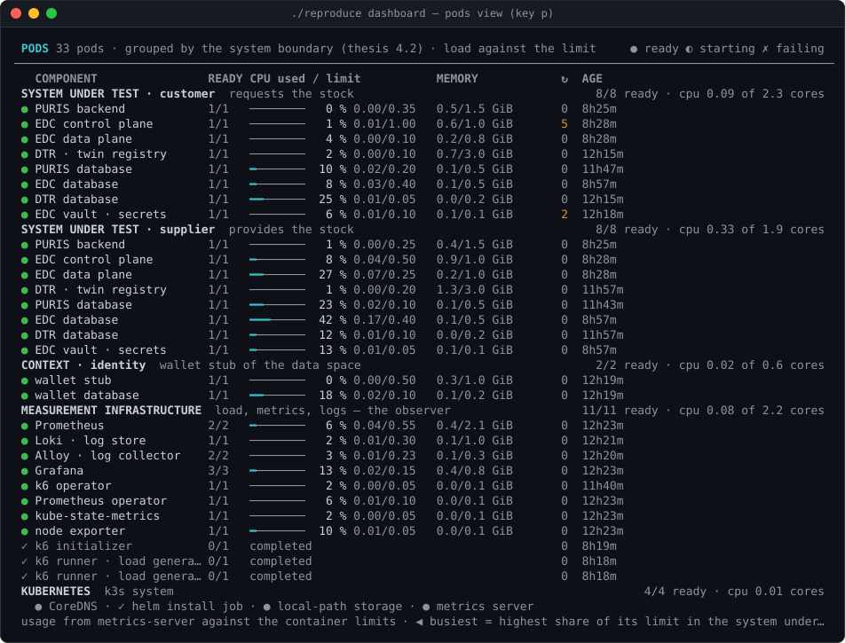
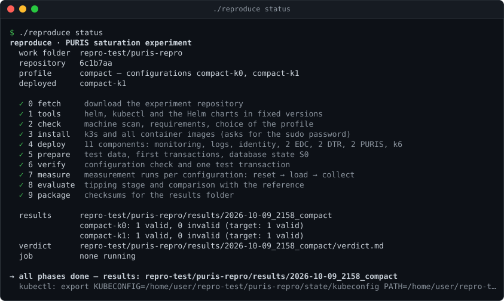
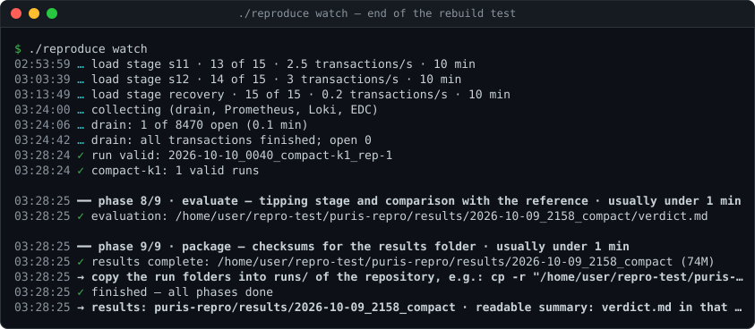
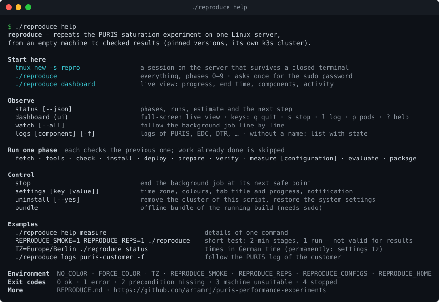
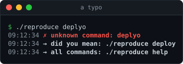

<div align="center">

# PURIS Performance Experiments

**Reproducible load and saturation experiments with PURIS (Eclipse Tractus-X)<br>on a Kubernetes-based data-space testbed**

Artefact of a bachelor's thesis · TU Dortmund University · Department of Computer Science

[](LICENSE)


[Overview](#overview) ·
[Setup](#experimental-setup) ·
[Methodology](#methodology) ·
[Results](#results) ·
[Rebuild test](#rebuild-test) ·
[Reproduction](#reproduction) ·
[Repository](#repository-layout) ·
[Limitations](#scope-and-limitations) ·
[Citation](#citation)

</div>

---

> [!NOTE]
> **About this project.** This repository was created as part of a **bachelor's thesis at TU Dortmund University** (Department of Computer Science). The thesis itself is written in **German**, and so is most of the detailed documentation in this repository ([`KONZEPT.md`](KONZEPT.md), [`AUFBAU.md`](AUFBAU.md), [`LABORBUCH.md`](LABORBUCH.md), [`ANLEITUNG.md`](ANLEITUNG.md), [`VPS-VARIANTE.md`](VPS-VARIANTE.md), [`CHECKLISTE.md`](CHECKLISTE.md)), as well as the labels of the generated figures and tables. This README, [`REPRODUCE.md`](REPRODUCE.md) and the output of the `reproduce` script are in English.

## Overview

This repository contains the complete experiment of a bachelor's thesis on the **scaling and saturation behaviour of the PURIS application** from the open-source project [Eclipse Tractus-X](https://eclipse-tractusx.github.io/). PURIS (*Predictive Unit Real-Time Information Service*) supports the short-term exchange of stock, demand, production and delivery information between business partners in the Catena-X data space.

The experiment studies the **Item Stock Exchange** (Catena-X standard CX-0122): a customer retrieves the stock of a supplier. A single transaction already passes through the entire call chain between two data-space participants – both connectors (EDC), the supplier's Digital Twin Registry (DTR) and both PURIS backends with their databases. This transaction is executed under a controlled, stepwise increasing load until the system saturates.

The repository is built so that every step can be traced and repeated:

- **Setup as code:** every component is a Helm release with a pinned version and fixed CPU and memory limits
- **Raw data:** every measurement run is stored completely and unchanged in [`runs/`](runs/), with checksums
- **Analysis:** a single command generates all figures, tables and key figures from the raw data
- **Documentation:** a binding concept, a step-by-step build log and a chronological laboratory notebook
- **Rebuild:** a single script ([`reproduce`](reproduce)) rebuilds the environment on an empty machine, measures and compares with the reference; a rebuild of the NAS VM from scratch reproduced the tipping points of K0 and K1 ([Rebuild test](#rebuild-test))

### Related thesis

| | |
|---|---|
| **Title** (German) | Empirische Charakterisierung des Skalierungs- und Sättigungsverhaltens der PURIS-Anwendung – Eine Fallstudie im Kontext industrieller Datenräume |
| **Title** (English translation) | Empirical Characterisation of the Scaling and Saturation Behaviour of the PURIS Application – A Case Study in the Context of Industrial Data Spaces |
| **Type** | Bachelor's thesis, Computer Science (B.Sc.) |
| **University** | TU Dortmund University, Department of Computer Science |
| **Language** | German |
| **Year** | 2026 |

**Research questions** (translated from the thesis)

| | |
|---|---|
| **RQ1** | How do throughput, response times, latency percentiles and error rates of the Item Stock Exchange workflow change under increasing load? |
| **RQ2** | From which load range do saturation effects occur, and which metrics make them visible? |
| **RQ3** | Which components show conspicuous patterns in resource usage or runtime behaviour at the point of saturation and are therefore bottleneck candidates? |

---

## Experimental setup

### Workflow under test

A transaction is triggered at the customer's backend with `GET /catena/stockView/update-reported-material-stocks`. The endpoint is **asynchronous**: it responds immediately, and the data exchange then runs in the background.



PURIS stores negotiated contracts and reuses them. If a retrieval fails, the contract data is discarded ("Invalidating … contract data") and the next retrieval negotiates again. A defined initial state is therefore restored before every run (see [Methodology](#methodology)).

### Components

The setup follows the PURIS deployment model (one EDC and one DTR **per participant**) and the Tractus-X "Hausanschluss" bundles. All components run on a single-node cluster (k3s) and address each other via Kubernetes service names.



| Block | Component | Helm chart | Application |
|---|---|---|---|
| `a1`–`a3` | Ubuntu Server, k3s, Helm | – | Ubuntu 26.04.1 LTS · k3s v1.37.1+k3s1 · Helm v4.3.0 |
| `b1` | Prometheus, Grafana, exporters | `kube-prometheus-stack` 91.9.0 | Prometheus v3.15.0 · Grafana 13.2.3 |
| `b2`, `b3` | Log storage and collection | `loki` 7.3.0 · `alloy` 1.13.0 | Loki 3.6.11 · Alloy v1.20.0 |
| `c1` | Identity, tokens, credentials, BPN directory (central) | `identity-and-trust-bundle` 1.1.3 | SSI DIM wallet stub 0.0.11 |
| `c2`, `c4` | EDC per participant (+ PostgreSQL, Vault) | `dataspace-connector-bundle` 1.3.0 | Tractus-X EDC 0.12.0 |
| `c3`, `c5` | DTR per participant (+ PostgreSQL) | `digital-twin-bundle` 1.3.0 | Digital Twin Registry 0.11.0 |
| `d1`, `d2` | PURIS backend per participant (+ PostgreSQL) | `puris` 7.2.0 (Git tag `puris-7.2.0`) | PURIS 6.2.0 |
| `e1`, `e2` | Test data (20 materials) and functional test | – (PURIS REST API) | – |
| `f1` | Load generator | `k6-operator` 4.6.0 | k6 operator 1.6.0 · k6 2.2.0 |

EDC 0.12.0 and DTR 0.11.0 are the versions PURIS has been aligned with since 6.0.0. Keycloak, portal, BPDM, discovery services, a separate BDRS server and an ingress controller are **deliberately not** part of the setup: they are not needed for the data exchange, and an additional proxy would sit in every request between the participants. PURIS is operated exclusively via its REST API with an API key. Rationale and sources: [`KONZEPT.md`](KONZEPT.md), section 3. All versions including image digests: [`AUFBAU.md`](AUFBAU.md), version overview.

### Environments and resource profiles

Every container has fixed limits (`requests = limits`, QoS `Guaranteed`); there is no autoscaling. The limits are a property of the experimental setup: with smaller limits, saturation occurs at lower load, while its course and the bottleneck remain measurable.

| Environment | Machine | Profile | Role |
|---|---|---|---|
| **Main environment (NAS VM)** | 8 vCPU (threads shared with the host), 32 GB RAM | `compact` (NAS profile): 7000m CPU allocatable, system under test 4.55 cores | Setup, pilot studies, main measurements K0 and K1; rebuild test with `reproduce` on the freshly installed VM |
| **Second environment** (VM of Fraunhofer ISST) | 24 vCPU, 48 GB RAM | `original`: the conditions of the NAS profile, only the resources as shipped by the Tractus-X charts | Original configuration (`original-k0`, `original-k1`) with `reproduce` – pending |

Resources per container with rationale: [`VPS-VARIANTE.md`](VPS-VARIANTE.md) (NAS profile) and [`AUFBAU.md`](AUFBAU.md), resource overview.

### Configurations

| Configuration | Change compared to K0 | Overlay |
|---|---|---|
| **K0** – baseline | – | `setup/*/values.yaml` |
| **K1** – EDC relieved | Control plane of the customer EDC 500m → 1000m, PostgreSQL of both EDCs 200m → 400m; the CPU is taken from barely used allocations (data planes, supplier Vault, both PURIS backends), so the total stays within 7000m | `setup/*/k1-nas.yaml` |
| `original-k0`, `original-k1` | CPU, memory, database presets and Java heap as shipped by the charts; health checks, log level, PURIS batch off, frontend off and persistence as on the NAS, so that only the resources differ. One correction: DTR memory 3 GiB (the image sets a heap of up to 2 GB, the chart gives 1 GiB). `original-k1`: PostgreSQL of both EDCs with preset `small` instead of `nano` | `setup/*/original.yaml`, `setup/*/original-k1.yaml` (`reproduce` only) |

K1 tests the bottleneck hypothesis from the pilot studies (RQ3): if a targeted relief of the EDC shifts the tipping point, its resources determine the performance limit. Every change to the setup is frozen with a Git tag: `setup-v1` (before K0), `setup-v2` (collector fixed, system under test unchanged), `setup-v3` (overlays and measurement plan for K1).

---

## Methodology

| Aspect | Implementation |
|---|---|
| **Load model** | Open model, k6 `constant-arrival-rate`; load = triggered transactions per second, not number of users |
| **Plan K0** ([`k0.env`](experiments/plans/k0.env)) | Warm-up 0.1 and 0.3/s · load stages 0.2 – 0.3 – 0.4 – 0.5 – 0.6 – 0.7 – 0.8 – 1.0/s · recovery stage 0.2/s · 10 min each · 20 materials |
| **Plan K1** ([`k1.env`](experiments/plans/k1.env)) | As K0, plus 1.5 – 2.0 – 2.5 – 3.0/s |
| **Initial state** | Before every run, PURIS and EDC of both participants are stopped, all seven databases are restored to a saved state and verified row by row, followed by an ordered restart and a functional test (`./lab reset`) |
| **Data sources** | k6 only provides the sent rate and `dropped_iterations` (proof that the planned load was sent). Completion, duration and errors of each transaction come from the PURIS logs (Loki) and the EDC transfer data; CPU, memory, CPU throttling and steal time from Prometheus |
| **Saturation criterion** | A stage is saturated if the completed transactions per second fall below 95 % of the input load. The **tipping point** of a run is the first saturated stage after warm-up. Errors (> 1 % failed) and contract invalidations are reported per stage as early indicators |
| **Validity per run** | Steal time (highest 1-min mean < 5 %, overall mean < 2 %), complete logs, no restarts during warm-up, pre-check before start; invalid runs are kept and complemented by a replacement run |
| **Repetitions** | At least three valid runs per configuration (`./lab series`) |
| **Reproducibility** | Terms following ACM: repeatable (repetitions), reproducible (rebuild with the published artefacts). Four pieces of evidence: repetitions with spread, rebuild test, open artefact, complete description ([`KONZEPT.md`](KONZEPT.md), section 8) |

---

## Results

> [!NOTE]
> **As of 10 October 2026 – main environment (NAS VM) and rebuild test.** Measurements with the original configuration on the second environment are still pending. All values are generated by [`analysis/evaluation.py`](analysis/evaluation.py) from `runs/` and `nachtrag/`; the interpretation is part of the thesis.

| Configuration | Valid runs | Stable up to | Tipping point per run | Median | Duration at 0.5/s (p50 / p95) | Recovery at 0.2/s |
|---|:-:|:-:|:-:|:-:|:-:|:-:|
| **K0-NAS** | 6 | 0.5–0.6/s | 0.7 · 0.6 · 0.7 · 0.7 · 0.6 · 0.7/s | 0.70/s | 3.4 s / 5.1 s | none |
| **K1-NAS** | 4 | 1.0–1.5/s | 1.5 · 2.0 · 1.5 · 1.5/s | 1.50/s | 3.1 s / 4.3 s | none |

**Observations**

- **Tipping point shifted:** K1 shifts the tipping point by a factor of about 2.1 in the median (2.4 in the mean). The distributions do not overlap (exact two-sided Mann-Whitney U test: U = 0, p = 0.005).
- **No recovery:** After tipping, the system completes no transactions even in the recovery stage (0.2/s) – in all valid runs of both configurations.
- **Trigger and amplification:** In the pilot studies, tipping started with a lock conflict between the EDCs (HTTP 409 "currently leased"). Timeouts lead to discarded contract data and to renegotiation per transaction; the tipped system stayed busy for hours after the load had ended.
- **Bottleneck candidate (hypothesis):** In K0, the control plane and the PostgreSQL of the EDCs were at their CPU limit and constantly throttled in the tipped state. The shifted tipping point in K1 supports this hypothesis.

<details>
<summary><b>All main measurement runs</b> (including invalid and aborted runs)</summary>

| Run | Configuration | Setup | Status | Tipping point | Max. steal |
|---|---|---|---|:-:|:-:|
| `2026-10-07_2341_k0_rep-1` | K0-NAS | `setup-v1` | invalid (steal time) | – | 6.0 % |
| `2026-10-08_0140_k0_rep-2` | K0-NAS | `setup-v1` | valid | 0.7/s | 1.9 % |
| `2026-10-08_0340_k0_rep-3` | K0-NAS | `setup-v1` | valid | 0.6/s | 2.2 % |
| `2026-10-08_0540_k0_rep-4` | K0-NAS | `setup-v1` | valid | 0.7/s | 1.9 % |
| `2026-10-08_1252_k0_rep-5` | K0-NAS | `setup-v2` | valid | 0.7/s | 2.4 % |
| `2026-10-08_1453_k0_rep-6` | K0-NAS | `setup-v2` | valid | 0.6/s | 1.9 % |
| `2026-10-08_1654_k0_rep-7` | K0-NAS | `setup-v2` | valid | 0.7/s | 2.1 % |
| `2026-10-08_1943_k1_rep-1` | K1-NAS | `setup-v3` | attempt (aborted) | – | – |
| `2026-10-08_2220_k1_rep-2` | K1-NAS | `setup-v3` | invalid (steal time) | – | 9.1 % |
| `2026-10-09_0106_k1_rep-3` | K1-NAS | `setup-v3` | valid | 1.5/s | 3.5 % |
| `2026-10-09_0352_k1_rep-4` | K1-NAS | `setup-v3` | valid | 2.0/s | 4.1 % |
| `2026-10-09_0646_k1_rep-5` | K1-NAS | `setup-v3` | attempt (rejected by pre-check) | – | – |
| `2026-10-09_0701_k1_rep-6` | K1-NAS | `setup-v3` | valid | 1.5/s | 3.8 % |
| `2026-10-09_0953_k1_rep-7` | K1-NAS | `setup-v3` | valid | 1.5/s | 3.8 % |

Source: [`analysis/out/tables/runs.csv`](analysis/out/tables/runs.csv). The two runs of the rebuild test (`2026-10-09_2210_compact-k0_rep-1`, `2026-10-10_0040_compact-k1_rep-1`) are also stored in [`runs/`](runs/); the analysis keeps them out of the main measurement (`discover(…, rebuild=False)`). The pilot run, smoke tests and pilot studies 1–3 (7 October 2026) are also stored in [`runs/`](runs/); their findings are described in [`LABORBUCH.md`](LABORBUCH.md) (German).

</details>

**Figures** (vector graphics, PDF, German labels):
[Throughput](analysis/out/figures/durchsatz_NAS.pdf) ·
[Duration](analysis/out/figures/dauer_NAS.pdf) ·
[Errors](analysis/out/figures/fehler_NAS.pdf) ·
[CPU per component](analysis/out/figures/cpu_NAS.pdf) ·
[Tipping points per run](analysis/out/figures/kipppunkte_NAS.pdf) ·
[Time series K0](analysis/out/figures/zeitreihe_K0-NAS.pdf) ·
[Time series K1](analysis/out/figures/zeitreihe_K1-NAS.pdf)

### Rebuild test

To check that the results are not an artefact of one installation, the NAS VM was emptied with `./reproduce uninstall` and rebuilt from the published repository with `REPRODUCE_REPS=1 ./reproduce`: real plan (10-minute stages), one valid run per configuration, 2026-10-09 20:44 → 2026-10-10 03:28 UTC, all ten phases. The success criterion was fixed in this README **before the start** (commit `9597dd0`): the median tipping point lies at most one load stage outside the range of the main runs.

| | Main measurement (NAS) | Rebuild |
|---|:-:|:-:|
| K0 · completed at 0.6/s | 76 % (21–100), 2 of 6 runs tipped | 100 % |
| K0 · completed at 0.7/s | 25 % (0–64), 6 of 6 tipped | 15 %, tipped |
| **K0 · tipping point** | **0.6–0.7/s** (median 0.70) | **0.7/s** ✓ |
| K1 · completed at 1.0/s | 100 % in 4 of 4 | 100 % |
| K1 · completed at 1.5/s | 53 % (19–97), 3 of 4 tipped | 42 %, tipped |
| **K1 · tipping point** | **1.5–2.0/s** (median 1.50) | **1.5/s** ✓ |
| Factor K1 / K0 | 2.1 (median) | 2.1 |
| Recovery at 0.2/s | none | none |

Both runs were valid: complete logs (3,068 and 8,470 transactions), steal time at most 4.2 %, and a complete drain. Up to the tipping point both runs were stable. Apart from one single error each (K0 at 0.4/s, K1 at 0.6/s, as in some main runs), errors and invalidations started only at the tipping point – the same pattern as in the main runs. **Result: reproduced for K0 and K1, without deviation.** Classification (ACM terms): repeatability with an independent rebuild – same hardware and author, setup rebuilt only from the published artefact. Reproducibility on other hardware follows with the `original` profile on the second environment. With one run per configuration the test says nothing about spread. Details: [`LABORBUCH.md`](LABORBUCH.md), entry of 2026-10-10 (German).

---

## Reproduction

### 1. Regenerate the analysis from the raw data

No cluster needed, takes a few seconds. Regenerates `analysis/out/` completely (figures, tables, `zahlen.tex` with LaTeX macros, `manifest.json` with inputs and code version). With unchanged raw data, figures, tables and key figures are byte-identical; only the commit entry in `manifest.json` changes.

```bash
git clone https://github.com/artamrj/puris-performance-experiments.git
cd puris-performance-experiments
python3 -m venv analysis/.venv
analysis/.venv/bin/pip install -r analysis/requirements.txt
analysis/.venv/bin/python analysis/evaluation.py
```

Dependencies are pinned in [`analysis/requirements.txt`](analysis/requirements.txt) (Python 3.14). The raw data amounts to about 0.5 GB.

### 2. Full rebuild with `reproduce`

<p align="center">
  
</p>
<p align="center"><sub>The live view (<code>./reproduce dashboard</code>) during the rebuild test on the NAS VM: run 1 of <code>compact-k1</code> at load stage s9, with the end time; <code>compact-k0</code> is already valid.<br>Terminal output of the script, rendered to SVG (<a href="docs/img/README.md">how</a>).</sub></p>

[`reproduce`](reproduce) is one self-contained script (Bash with an embedded Python helper) that takes an **empty Linux server to checked results**. It installs k3s and every component in its pinned version and creates the test data. It then measures each configuration with the plans of the thesis and judges every run by the same validity rules as `lab`. Finally it compares the tipping point with the reference and stores the runs in the format of `runs/`. It is meant for anyone who wants to repeat the experiment, and it is how the second environment of the thesis is measured.

| | |
|---|---|
| **Runs on** | One Ubuntu Server (amd64) with `sudo` and internet access; it installs its own single-node k3s |
| **Chooses** | The profile from the size of the machine: `compact` (8 vCPU or more) or `original` (20 vCPU or more); a calculator in phase `check` decides before anything is installed |
| **Takes** | About 7 h with one run per configuration (rebuild test: 6 h 44 min); about 16–20 h with three runs |
| **Produces** | Run folders as in [`runs/`](runs/), `summary.json`, a readable `verdict.md` and checksums |
| **Specification** | [`REPRODUCE.md`](REPRODUCE.md): every decision, phase, rule and failure case |

#### Quick start

Run it **on the server** (for example after `ssh <server>`), not on a laptop, and **inside `tmux`**, so that it keeps running when the terminal is closed:

```bash
tmux new -s repro     # session on the server; survives a lost connection (missing: sudo apt-get install -y tmux)
curl -fsSLO https://raw.githubusercontent.com/artamrj/puris-performance-experiments/main/reproduce
chmod +x reproduce
./reproduce           # never with sudo – it asks for the sudo password itself, once at the start
```

1. The script asks **once** for the sudo password. It is needed only to install k3s and to switch off swap and automatic updates.
2. After a few minutes it prints an **estimate of the end**. In the rebuild test it printed `estimate: about 7 h 12 min left → done around 04:01 UTC on Sat 10 Oct`; the run finished at 03:28. The estimate is updated after every run.
3. **Now the own computer can be switched off.** Press `Ctrl-b`, then `d`; the `tmux` session keeps running on the server. From phase 4 on, the work runs as a background job on the server anyway.
4. **Coming back later:** `ssh <server>`, then `./reproduce dashboard` (live view), `./reproduce status` (short overview) or `tmux attach -t repro`.

Without `tmux`, the terminal must stay connected until the line `The next steps run in the background` appears, after phase `install`. A lost connection before that stops the script; running `./reproduce` again continues where it stopped.

```bash
REPRODUCE_REPS=1 ./reproduce                  # one valid run per configuration (default: 3); more can be added later
REPRODUCE_CONFIGS=original-k1 ./reproduce     # only these configurations
REPRODUCE_SMOKE=1 REPRODUCE_REPS=1 ./reproduce   # short test with 2-minute stages – checks the pipeline, not valid for results
```

#### The ten phases

Each phase checks the previous one and skips work that is already done. Durations were measured in the rebuild test (NAS VM, 8 vCPU, profile `compact`, one run per configuration).

| # | Phase | What happens | Rebuild test |
|:-:|---|---|--:|
| 0 | `fetch` | Clone the repository; the commit is recorded in every run | 0 min |
| 1 | `tools` | `helm`, `kubectl` and all 8 Helm charts in pinned versions | 0 min |
| 2 | `check` | Machine scan, steal time, calculator → profile | 1.5 min |
| 3 | `install` | k3s, swap and automatic updates off, container images (sudo) | 3 min |
| 4 | `deploy` | 11 components in dependency order; each one waits until it is ready | 44 min |
| 5 | `prepare` | Test data (20 materials), first transactions, database state S0 with checksums | 25 min |
| 6 | `verify` | Running resources = configuration; one test transaction | 1 min |
| 7 | `measure` | Per configuration: log capacity probe; per run: reset to S0 → load → drain → collect → validity | 5 h 30 min |
| 8 | `evaluate` | Tipping stage per run, comparison with the reference → `verdict.md` | < 1 min |
| 9 | `package` | Checksums of the results folder | < 1 min |

In the rebuild test, `measure` took 2 h 04 min for the run of `compact-k0` (11 stages) and 26 min for switching to `compact-k1` with a new probe. The run of `compact-k1` (15 stages) took 2 h 48 min, including 12 min of waiting for a quiet machine. The customer DTR alone needs about 18 min to start on 8 vCPU.

#### Watching a run

`./reproduce dashboard` shows the following panels:

- **Top:** the current phase and what it is waiting for, one overall progress bar and the expected end.
- **Phases:** each phase with its measured duration.
- **Context panel:** during `deploy` the components with their start-up times, during `measure` the stages of the current run.
- **Cluster:** pods per namespace and the load of the node.
- **Runs:** valid runs of the target, per configuration.
- **Activity:** the last events.

Keys: `q` quit · `s` stop the job · `l` full log · `p` pods · `?` help · `r` refresh. Closing the view never stops the job.

<p align="center">
  
</p>

**Measurement-safe mode.** While a run measures, the view makes no `kubectl` calls and reads the state only every 5 minutes. On the NAS VM this lowered its own load from 0.19 to 0.013 cores (measured), so watching does not disturb the measurement. Header badge: `◆ measurement-safe`; `r` reads everything once.

<details>
<summary><b>Pods view</b> (key <code>p</code>): every container grouped by the system boundary of the thesis</summary>
<br>
<p align="center"></p>

The groups are: system under test (customer, supplier), context (identity), measurement infrastructure and Kubernetes. Each container shows its CPU use against its limit, its memory, restarts and age. The busiest container of the system under test is marked. Captured on the idle cluster after the rebuild test.
</details>

<details>
<summary><b>Line output</b>: <code>./reproduce status</code> and <code>./reproduce watch</code></summary>
<br>
<p align="center"></p>
<p align="center"></p>

Every line starts with the time and a symbol: `✓` done · `…` in progress · `▶` run starts · `!` warning · `✗` error · `→` next step. Colours are switched off automatically without a terminal or with `NO_COLOR`.
</details>

#### Commands

| Command | Effect |
|---|---|
| `./reproduce` | All phases; continues where it stopped |
| `./reproduce dashboard` | Full-screen live view (above) |
| `./reproduce status [--json]` | Phases, runs, estimate and the next step |
| `./reproduce watch` | Follow the background job line by line (`Ctrl-C` closes only the view) |
| `./reproduce logs [component] [-f]` | Logs of PURIS, EDC, DTR, …; without a name: a list with the state of each component |
| `./reproduce <phase>` | One phase: `fetch` … `package`; `measure compact-k1` measures one configuration |
| `./reproduce stop` | End the background job at its next safe point |
| `./reproduce settings` | Time zone, colours, tab title and progress, notification when the job ends |
| `./reproduce uninstall` | Remove the cluster of the script, restore swap and automatic updates; S0 is set aside |
| `./reproduce help [command]` | All commands with examples; a mistyped command gets a suggestion |

<details>
<summary><b>Help screen</b></summary>
<br>
<p align="center"></p>
<p align="center"></p>
</details>

#### Profiles

| | `compact` | `original` |
|---|---|---|
| **Machine** | 8 vCPU or more, 28 GB RAM or more (32 GB recommended) | 20 vCPU or more (24 vCPU and 32 GB RAM recommended) |
| **Resources** | NAS profile: `requests = limits` for every container, system under test 4.55 cores | As shipped by the Tractus-X charts: the script removes `resources`, `resourcesPreset` and `JAVA_TOOL_OPTIONS` from the system under test; one correction: DTR memory 3 GiB |
| **Everything else** | NAS profile | Same as `compact`: health checks, log level, PURIS batch off, frontend off, persistence; only the resources differ |
| **Configurations** | `compact-k0` (= K0), `compact-k1` (= K1) | `original-k0`; `original-k1` with the EDC databases at preset `small` instead of `nano` |
| **Plans** | K0: 11 stages up to 1.0/s · K1: 15 stages up to 3.0/s | `original-k0`: 15 stages up to 3.0/s · `original-k1`: 14 stages up to 12/s |
| **Reference** | [`reference/compact-k0.json`](reference/compact-k0.json) (6 runs), [`compact-k1.json`](reference/compact-k1.json) (4 runs) | None yet; the first result is proposed as the reference |

Tractus-X publishes no sizing for production: the umbrella chart is meant for testing, sandbox and development. The resources as shipped are therefore a starting configuration for testing, and `original` measures exactly that. A configuration that does not become ready is itself a result. Sources and reasoning: [`REPRODUCE.md`](REPRODUCE.md), §7.4.

#### What the script takes care of

- **Resumable:** after an interruption, `./reproduce` continues where it stopped. The background job runs from its own copy of the script, so a new download does not change a running job.
- **Same start for every run:** before each run, all databases are reset to S0 with checksums and the services restart in order. A conformance check confirms that the running resources match the configuration, followed by one test transaction.
- **Validity as in the thesis:** a run is valid only with low steal time, complete logs, no restarts during warm-up and a complete drain. Invalid runs are kept and replaced automatically.
- **Quiet machine:** before each run, the script waits up to 60 min until the steal time is below 1 %.
- **Complete logs:** before measuring, a probe runs 3 min at the highest planned rate and checks that Loki receives every transaction.
- **Watchdog:** a hanging load test is detected and stopped.
- **Honest estimate:** the end time uses the overhead measured in the finished runs.
- **Clean teardown:** `uninstall` removes only what the script installed.

#### Results

Each measurement creates a results folder `puris-repro/results/<date>_<time>_<profile>/` containing:

- the run folders `…_<configuration>_rep-<n>/`, in the same format as [`runs/`](runs/);
- `machine.json` and `probe-<configuration>.json`;
- `summary.json` and `verdict.md`;
- `SHA256SUMS`.

`verdict.md` of the rebuild test, evaluated with the current references:

| Configuration | valid runs | tipping stage (median, range) | capacity | recovery | comparison |
|---|---|---|---|---|---|
| compact-k0 | 1 of 1 | 0.7/s (0.7/s – 0.7/s) | 0.6/s | 0 of 1 | reproduced |
| compact-k1 | 1 of 1 | 1.5/s (1.5/s – 1.5/s) | 1/s | 0 of 1 | reproduced |

**Criterion** (fixed before measuring): a configuration is reproduced if the median tipping stage lies at most one load stage outside the range of the reference. The accepted range is 0.5–0.8/s for `compact-k0` and 1.0–2.5/s for `compact-k1`. A mismatch is not a failure: it is reported and explained, for example by the CPU speed in `machine.json`. To add the runs to the repository, use `cp -r puris-repro/results/<folder>/*_rep-* runs/`; the analysis keeps rebuild runs of the `compact` profile apart from the main measurement.

#### Test status

| Date | Machine | What ran | Result |
|---|---|---|---|
| 2026-10-09 | NAS VM, emptied | Short test (2-minute stages, one run per configuration): all phases, including the switch from K0 to K1 and `uninstall` | Pipeline works; faults fixed and covered by `tests/test_reproduce_static.py` |
| 2026-10-09/10 | NAS VM, emptied with `uninstall` | Rebuild test, real plan, one run per configuration | K0 0.7/s, K1 1.5/s, **reproduced** ([Rebuild test](#rebuild-test)) |
| pending | Second environment (24 vCPU, 48 GB) | Profile `original` | – |

Not yet run on a cluster: repair after a reboot of the machine (§22.4) and the offline bundle (§22.11).

<details>
<summary><b>Questions</b></summary>

- **Can I switch off my own computer?** Yes, once the sudo password is entered and the estimate is shown, provided the script runs inside `tmux` on the server (see the quick start).
- **How do I know when it is done?** `status` and the dashboard show the expected end. An open view rings the bell when the job ends; with `./reproduce settings notify desktop` it sends a desktop notification instead.
- **A phase failed – what now?** The message names the cause and the next step (lines with `→`). After the cause is fixed, `./reproduce` continues at that phase. The full log is in `puris-repro/state/logs/`.
- **Can more runs be added later?** Yes: `REPRODUCE_REPS=3 ./reproduce measure` adds runs to the same results folder until three are valid.
- **`original-k0` does not start?** That is a result in itself. Measure the other configuration alone with `REPRODUCE_CONFIGS=original-k1 ./reproduce`.
- **Does watching change the measurement?** No: during a measurement the dashboard switches to measurement-safe mode (above).
- **How do I remove everything?** `./reproduce uninstall` removes the cluster and restores the system settings. The results folder is kept.

</details>

### 3. Measurement runs on an existing setup with `lab`

The main measurements on the NAS VM were performed with [`lab`](lab). A run only starts on the VM and only with a clean Git state, so that the commit hash in `meta.json` is valid. Messages of `lab` are in German.

| Command | Effect |
|---|---|
| `./lab snapshot <name>` | Save the state of all seven databases |
| `./lab reset <name>` | Restore and verify the initial state |
| `./lab check` | Functional test: three real transactions in a row |
| `./lab run <plan> <rep>` | One measurement run: pre-check → reset → functional test → load → drain → collection into `runs/` |
| `./lab series <plan> <n>` | Measurement series with a replacement run for every failed run |
| `./lab status` | Last message, lock, readiness of PURIS and EDC, active load |

### 4. Manual setup

[`AUFBAU.md`](AUFBAU.md) (German) contains every command that was actually executed, in the order of execution, with a check and the observed result – from the empty VM to the functional test.

### Tests

The calculation rules of the analysis, the collector, the safeguards of `lab` and the static checks of `reproduce` (profiles, plans, overlays, shell pitfalls) are covered by unit tests (no cluster needed):

```bash
analysis/.venv/bin/python -m unittest discover -s tests
```

---

## Repository layout

```text
.
├── KONZEPT.md          Binding concept: building blocks, rules, measurement, reproducibility, decisions
├── AUFBAU.md           Step-by-step build log with version and resource overview
├── LABORBUCH.md        Chronological laboratory notebook: problems, findings, decisions
├── ANLEITUNG.md        Overview in plain language
├── VPS-VARIANTE.md     NAS profile, steal time, options for the rebuild test
├── REPRODUCE.md        Specification of `reproduce` (English)
├── CHECKLISTE.md       Progress per stage and building block
├── lab                 Control of measurement runs (reset, run, series, status)
├── reproduce           Self-contained script for rebuild and measurement
├── lib/                Helpers of `lab` (databases, lifecycle, Loki, snapshots)
├── setup/              Helm values per building block (a2 … d2), overlays for K1 and `original`, test data (e1)
├── experiments/
│   ├── plans/          Measurement plans (load stages, duration, validity limits)
│   ├── k6/             k6 script and TestRun generation
│   └── collect/        Collection of measurement data after each run
├── runs/               Raw data: one folder per measurement run, never modified
├── nachtrag/           Complete Loki logs for runs up to 8 October 2026 (run folders unchanged)
├── reference/          Reference results (`compact-k0`, `compact-k1`) for the comparison in `reproduce`
├── analysis/           Analysis: runs/ → out/ (figures, tables, key figures)
├── tests/              Unit tests for analysis, collector, lab and reproduce
├── tools/              ANSI → SVG converter and capture script for the screenshots
└── docs/img/           Screenshots of `reproduce` (terminal output as SVG)
```

All Markdown documents except this README, `REPRODUCE.md` and `docs/img/README.md` are written in German.

**Contents of a run folder** (`runs/<date>_<time>_<plan>_rep-<n>/`):

| File / folder | Contents |
|---|---|
| `meta.json` | Git commit, tag, versions, measurement plan, configuration, timestamps of every stage (UTC), node information, validity |
| `attempt.json`, `events.jsonl`, `reset.json` | Course of the attempt, events, result of the reset |
| `k6-summary.json`, `k6-stages.json`, `testrun.json` | Sent load, stage boundaries, k6 TestRun used |
| `loki/` | PURIS logs of both participants, warnings and errors of the EDCs |
| `edc/` | Contract negotiations and transfer times of both EDCs |
| `prometheus/` | CPU, memory, throttling, threads, restarts, steal time, k6 metrics (CSV) |
| `db/` | Row counts of all seven databases after the run |
| `cluster/` | Pods, Helm releases, images with digests, log of the k6 runner |
| `SHA256SUMS` | Checksums of all files of the run |

---

## Scope and limitations

The results apply to the documented configuration and the defined load profiles; they do not constitute a general performance statement about PURIS or Tractus-X installations. Known limitations:

- **One workflow, one direction:** only the Item Stock Exchange, with the customer retrieving from the supplier; one partner, 20 materials. Transferability to other PURIS workflows is an untested hypothesis.
- **Single node:** all components, the measurement infrastructure and the load generator share one node; their consumption and throttling are recorded per run.
- **Shared hardware:** the NAS VM shares its threads with the host (performance and efficiency cores). The influence is measured via steal time and bounded as a validity criterion.
- **Simplified data space:** wallet stub instead of a full identity infrastructure, Vault in dev mode, DTR without authentication, bundles intended for test and pilot environments; deviations from the PURIS reference are documented in [`KONZEPT.md`](KONZEPT.md).
- **Asynchronous measurement:** duration and success of a transaction are reconstructed from logs, not taken from the HTTP response time.
- **Bottleneck analysis:** bottlenecks are derived as candidates from temporal correlation and targeted relief (K1); K1 changes the control plane and the databases of the EDC at the same time.

---

## Methodological foundations and sources

- S. Henning, B. Wetzel, W. Hasselbring (2021): reproducible benchmarking of cloud-native applications on Kubernetes
- S. Kounev et al. (2025): *Systems Benchmarking*
- ACM: *Artifact Review and Badging* (terms repeatable, reproducible, replicable)
- [PURIS 6.2.0](https://github.com/eclipse-tractusx/puris/releases/tag/6.2.0) · [Helm chart `puris` 7.2.0](https://github.com/eclipse-tractusx/puris/tree/6.2.0/charts/puris) · [Runtime view of the architecture documentation](https://github.com/eclipse-tractusx/puris/blob/6.2.0/docs/architecture/06_runtime_view.md)
- [Tractus-X umbrella](https://github.com/eclipse-tractusx/tractus-x-umbrella) · [k6: open and closed load models](https://grafana.com/docs/k6/latest/using-k6/scenarios/concepts/open-vs-closed/)

---

## Citation

If you use this work, please cite the related bachelor's thesis and this repository with a tag or commit hash – every run folder and every analysis output records the commit it was produced with.

```bibtex
@software{puris_performance_experiments,
  title   = {PURIS Performance Experiments: Reproducible Load and Saturation Experiments
             with PURIS (Eclipse Tractus-X)},
  url     = {https://github.com/artamrj/puris-performance-experiments},
  version = {setup-v3},
  year    = {2026},
  note    = {Artefact of the bachelor's thesis "Empirische Charakterisierung des Skalierungs-
             und Sättigungsverhaltens der PURIS-Anwendung" (in German), TU Dortmund University}
}
```

## License

[Apache License 2.0](LICENSE). The components used (PURIS, Tractus-X EDC, Digital Twin Registry, wallet stub, Grafana stack, k6) are subject to their own licenses. The test data is fictitious data from the PURIS integration tests. Credentials in this repository are test values only (publicly known chart defaults or fixed test passwords of `reproduce`, marked as such); EDC keys are generated locally per machine and are not published. Not intended for production use.
